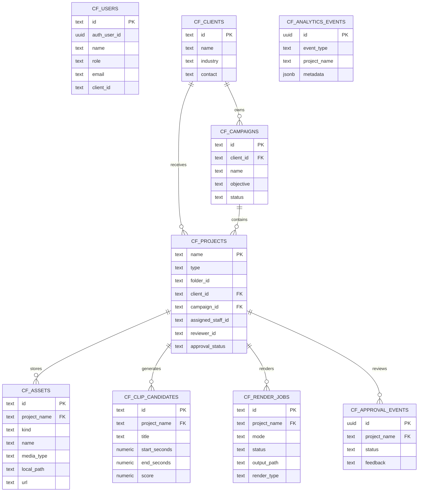
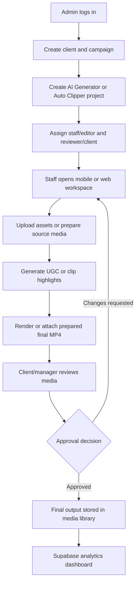
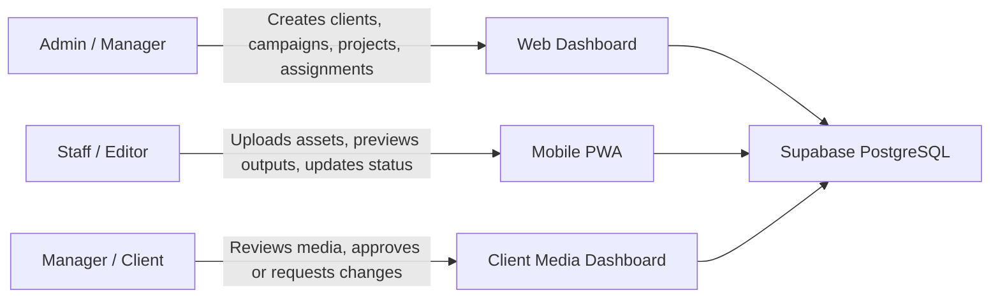

# ContentFlow AI FYP Evidence Package

## System Summary

ContentFlow AI is an AI-assisted content operations management system for a small social media agency. It manages clients, campaigns, projects, uploaded media assets, AI Generator outputs, Auto Clipper outputs, approval review, mobile staff actions, and production analytics through a web dashboard, mobile PWA module, and Supabase PostgreSQL backend.

## ERD

## System Flow

## Role-Based Workflow

## FYP Checklist Mapping

| Requirement | Evidence in System |
|---|---|
| Real organization/domain | Small social media agency / Digital Bee content production workflow |
| Web application | Admin dashboard for projects, clients, campaigns, media, analytics |
| Mobile application | Installable mobile staff PWA at `/mobile.html` |
| Database backend | Supabase PostgreSQL schema and API write-through |
| Digital content management | Assets, source videos, final MP4s, clip candidates, approvals |
| Data analysis | Supabase analytics for projects, renders, approvals, workload, assets |
| Not rental/booking system | Content operations and digital asset management system |

## Functional Test Matrix

| Test Case | Expected Result | Status |
|---|---|---|
| Admin login | Admin dashboard, project creation, Supabase sync, and Command Center visible | PASS - 2026-07-14 |
| Staff login | Only assigned projects and project-scoped production data visible | PASS - 2026-07-14 |
| Client login | Only client/reviewer media, approvals, and analytics visible | PASS - 2026-07-14 |
| Project creation | Local project and Supabase `cf_projects` row created | PASS - 2026-07-14 |
| Asset upload | Local file saved and Supabase `cf_assets` row created | PASS - 2026-07-14 |
| Prepared Auto Clipper execution | Local prepared source, transcript, and selected highlight are accepted by the worker | PASS - prepared local state rendered on 2026-07-14 |
| Hosted Auto Clipper handoff | Hosted source link and browser-selected highlight reach the production worker end-to-end | PARTIAL - highlight and stable reaction ID reached the queued payload; source-link download and worker rendering were not exercised from that job |
| Character variations | Two selected reaction-character inputs produce two reachable MP4 outputs with the expected visual identities | PARTIAL - 2 outputs returned HTTP 200, but character identity was not manually frame-inspected in the final run |
| Render output | Render job, result, and hosted media URL persist in Supabase | PASS - 2026-07-14 |
| Approval update | Project status and `cf_approval_events` updated | PASS - 2026-07-14 |
| Analytics | Production, approval, staff, campaign, and asset metrics query Supabase | PASS - 2026-07-14 |
| Mobile route | Mobile PWA loads assigned work and role-appropriate controls | PASS - 2026-07-14 |
| Live LibTV generation | New UGC video generated through Kling O3 | BLOCKED - LibTV legacy Skill to CLI migration |

The complete execution record, job IDs, hosted output links, and remediation steps are in [FYP_SYSTEM_TEST_RESULTS.md](./FYP_SYSTEM_TEST_RESULTS.md).

Matrix status count: **10 PASS**, **2 PARTIAL**, **0 NOT TESTED**, **1 BLOCKED**, **0 FAIL** (13 test cases). The remaining hosted rendering gap and character visual-verification gap are separate from the external LibTV migration blocker.

## Screenshot Checklist

- Web login screen
- Admin dashboard
- Clients and campaigns panel
- AI Generator project view
- Auto Clipper project view
- Media library
- Analytics dashboard
- Mobile staff project list
- Mobile upload/detail view
- Client-only media/review view
- Supabase table editor showing `cf_projects`, `cf_assets`, `cf_render_jobs`, `cf_approval_events`

## Hosted Demo Notes

The hosted demo should use Supabase Auth, Supabase PostgreSQL, and prepared media outputs. Heavy generation actions such as yt-dlp download, Remotion render, LibTV, and OpenAI generation may be kept local/admin-side or disabled in hosted mode to keep the lecturer demo reliable.

The production worker, queue behavior, and prepared-media path are validated. Hosted highlight and reaction selection now persists into the queued payload, but the source-link request still needs to be continued through worker rendering. The two character-variation files also need a manual visual identity check. Prepared outputs are recommended for the lecturer demonstration until those checks are completed and the workstation is authenticated with the new LibTV CLI with the Kling O3 adapter re-tested.
