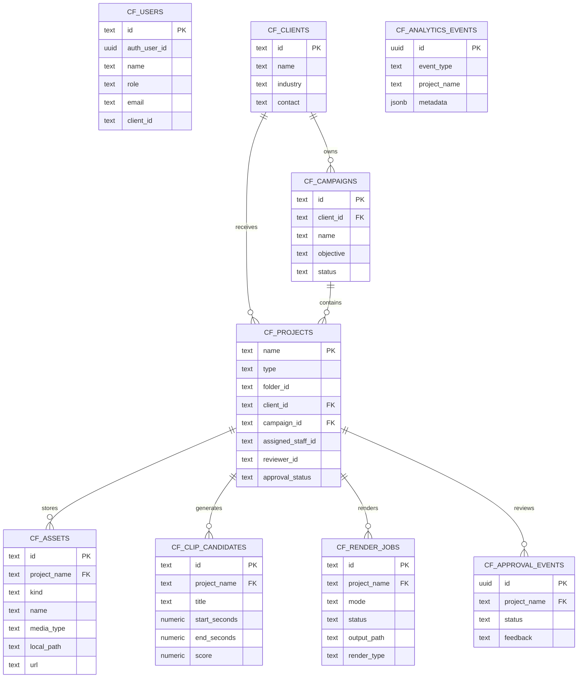
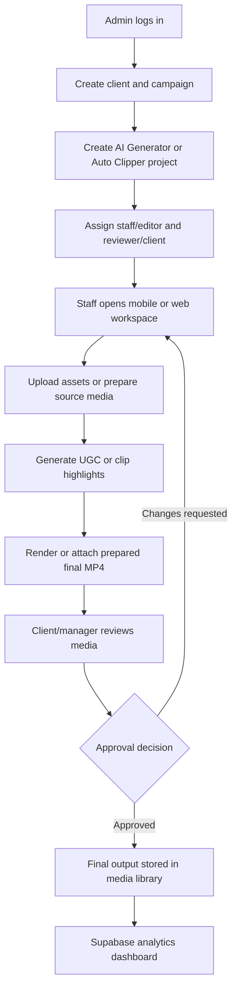
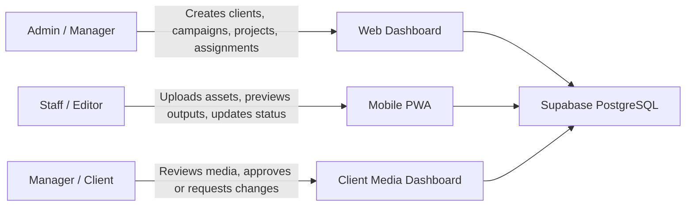

# ContentFlow AI FYP Evidence Package

## System Summary

ContentFlow AI is an AI-assisted content operations management system for a small social media agency. It manages clients, campaigns, projects, uploaded media assets, AI Generator outputs, Auto Clipper outputs, approval review, mobile staff actions, and production analytics through a web dashboard, mobile PWA module, and Supabase PostgreSQL backend.

## ERD

## System Flow

## Role-Based Workflow

## FYP Checklist Mapping

| Requirement | Evidence in System |
|---|---|
| Real organization/domain | Small social media agency / Digital Bee content production workflow |
| Web application | Admin dashboard for projects, clients, campaigns, media, analytics |
| Mobile application | Installable mobile staff PWA at `/mobile.html` |
| Database backend | Supabase PostgreSQL schema and API write-through |
| Digital content management | Assets, source videos, final MP4s, clip candidates, approvals |
| Data analysis | Supabase analytics for projects, renders, approvals, workload, assets |
| Not rental/booking system | Content operations and digital asset management system |

## Functional Test Matrix

| Test Case | Expected Result | Status |
|---|---|---|
| Admin login | Admin dashboard, project creation, Supabase sync visible | Ready for demo account testing |
| Staff login | Only assigned projects visible | Ready for demo account testing |
| Client login | Only client/reviewer media and analytics visible | Ready for demo account testing |
| Project creation | Local project and Supabase `cf_projects` row created | Implemented |
| Asset upload | Local file saved and Supabase `cf_assets` row created | Implemented |
| Clip analysis | Highlight candidates saved and synced to Supabase | Implemented |
| Render output | Render job saved to Supabase `cf_render_jobs` | Implemented |
| Approval update | Project status and `cf_approval_events` updated | Implemented |
| Mobile route | Mobile PWA loads and uses same auth/session | Implemented |

## Screenshot Checklist

- Web login screen
- Admin dashboard
- Clients and campaigns panel
- AI Generator project view
- Auto Clipper project view
- Media library
- Analytics dashboard
- Mobile staff project list
- Mobile upload/detail view
- Client-only media/review view
- Supabase table editor showing `cf_projects`, `cf_assets`, `cf_render_jobs`, `cf_approval_events`

## Hosted Demo Notes

The hosted demo should use Supabase Auth, Supabase PostgreSQL, and prepared media outputs. Heavy generation actions such as yt-dlp download, Remotion render, LibTV, and OpenAI generation may be kept local/admin-side or disabled in hosted mode to keep the lecturer demo reliable.
