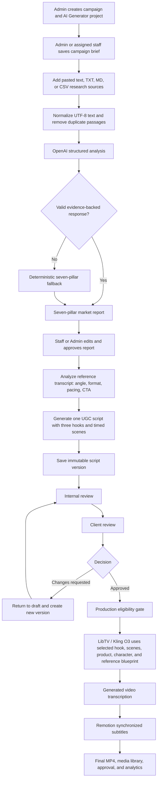
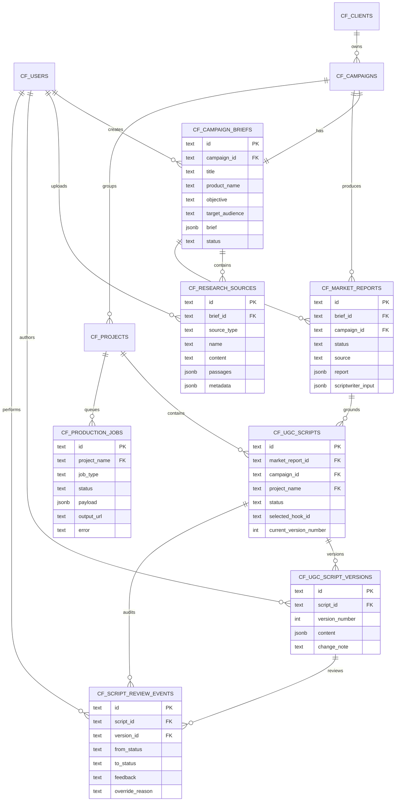
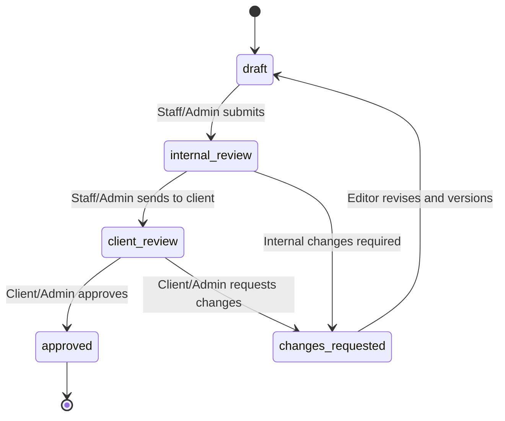
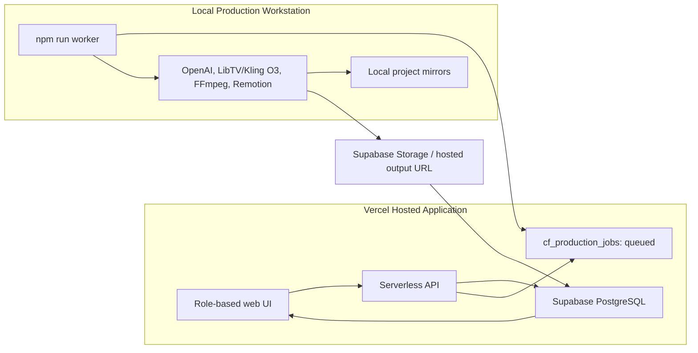
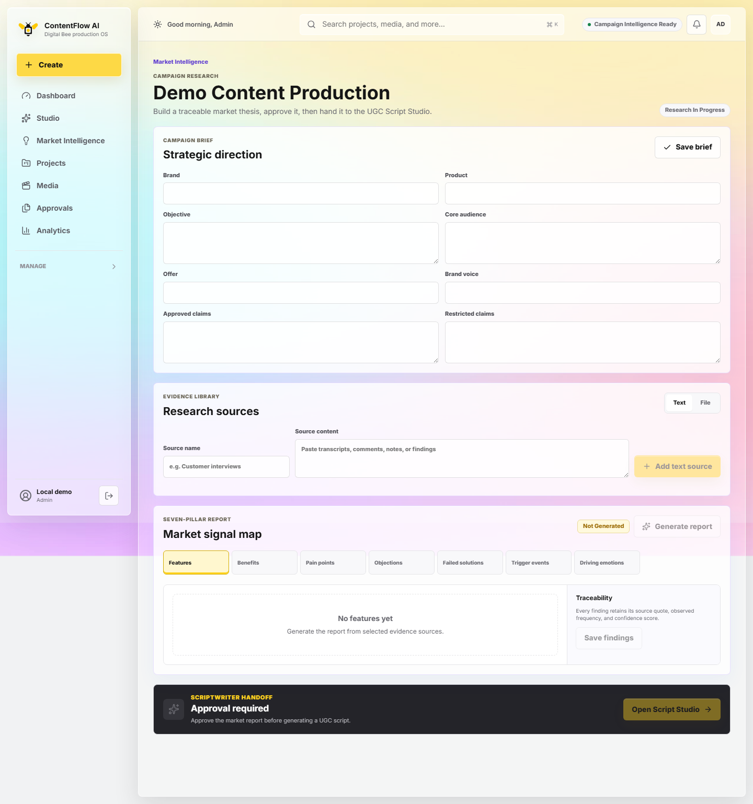
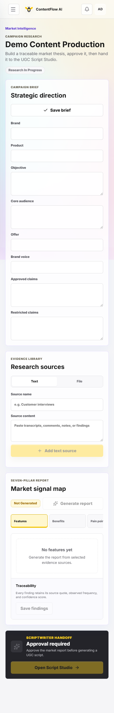

# Market Intelligence and UGC Script Studio

## 1. Feature Overview

This extension turns ContentFlow AI from a production-only tool into an evidence-led content management system. A campaign brief and customer research are analyzed into a reusable seven-pillar market report. An assigned AI Generator project then uses the approved report and a reference-video transcript to create, review, approve, and produce a versioned UGC script.

The implemented workflow is:

```text
Campaign Brief
  -> Research Sources (pasted text, TXT, MD, CSV)
  -> Seven-Pillar Market Report
  -> Market Report Approval
  -> Reference Transcript Analysis
  -> UGC Script with Three Hooks and Timed Scenes
  -> Internal Review
  -> Client Review
  -> Approval or Changes Requested
  -> LibTV / Kling O3 Video Generation
  -> Transcription and Remotion Subtitles
  -> Final MP4 and Analytics
```

The feature preserves the existing Auto Clipper workflow. It also supports both the local full-production application and the Vercel-hosted management application connected through Supabase.

## 2. User Roles and Responsibilities

| Role | Market Intelligence | UGC Script Studio | Production |
|---|---|---|---|
| Admin | View all campaigns; create/edit briefs and sources; generate, edit, and approve reports | Generate and edit scripts; perform any valid review transition; inspect versions and audit events | Generate from an approved script or record a reasoned Admin override |
| Staff / Editor | Access assigned campaigns; create/edit research; generate, edit, and approve reports | Analyze references; generate and edit scripts; submit for internal/client review; respond to changes | Queue or run generation for assigned projects after approval |
| Manager / Client | Read approved findings for their own client campaigns | Review scripts at `client-review`; approve or request changes | View approved media and campaign analytics; no production controls |

Role access is enforced by campaign/client relationships and project assignments. Client users cannot edit research, access internal script analysis, or invoke generation controls.

## 3. System Flow



## 4. ERD Extension



Important integrity rules include one campaign brief per campaign, unique script version numbers within each script, controlled report/script status values, and foreign keys that preserve report and review traceability.

## 5. Seven-Pillar Market Report

Each pillar contains structured findings with an insight, source-linked evidence quotes, observed frequency, and confidence from `0` to `1`.

| Pillar | Research Question | Script Use |
|---|---|---|
| Features | What does the product or service include? | Demonstration scenes and factual product details |
| Benefits | What useful outcome does the customer receive? | Value proposition and payoff |
| Pain Points | What problem or frustration is the customer experiencing? | Hook, problem statement, and empathy |
| Objections | Why might the customer hesitate or refuse? | Objection handling and reassurance |
| Failed Solutions | What has the customer already tried without success? | Contrast and problem escalation |
| Trigger Events | What event makes the problem urgent now? | Timely opening angle and context |
| Driving Emotions | What emotion influences the decision? | Tone, story progression, and CTA motivation |

Only evidence quotes found in an uploaded source are retained. Unsupported model output is rejected or replaced with deterministic fallback findings. The generated Scriptwriter Input Block includes the brand, product, target audience, top pain points, objections, customer phrases, and evidence rules.

## 6. UGC Script and Approval Lifecycle

Each generation creates one complete script with exactly three selectable hooks and structured scenes containing `visualAction`, `audioSpokenWord`, timing, and evidence. Editing creates a new immutable version instead of replacing the audit history.



Implementation status names use hyphens: `draft`, `internal-review`, `client-review`, `changes-requested`, and `approved`.

Video generation is blocked unless the active script is approved. An Admin may bypass the gate only by supplying a non-empty reason tied to the active script version. The override is stored as an audit event and carried in the production-job payload.

## 7. API Interface

All routes are prefixed with `/api`. Hosted requests use the authenticated Supabase user; local development without an authenticated user operates as the local Admin context.

| Method | Endpoint | Purpose | Authorized role | Execution path |
|---|---|---|---|---|
| GET | `/intelligence` | List role-visible campaigns and intelligence status | Admin, assigned Staff, related Client | Direct read |
| GET | `/campaigns/:campaign/intelligence` | Read brief, sources, and active report | Admin, assigned Staff, related Client; client receives approved/redacted findings | Direct read |
| PUT | `/campaigns/:campaign/brief` | Create or update the reusable campaign brief | Admin, assigned Staff | Direct write |
| POST | `/campaigns/:campaign/research-sources/text` | Add pasted research text | Admin, assigned Staff | Direct write |
| POST | `/campaigns/:campaign/research-sources/file` | Add UTF-8 TXT, MD, or CSV content | Admin, assigned Staff | Direct write |
| DELETE | `/campaigns/:campaign/research-sources/:sourceId` | Remove one campaign research source | Admin, assigned Staff | Direct write |
| POST | `/campaigns/:campaign/market-reports/generate` | Generate a seven-pillar report from selected sources | Admin, assigned Staff | Local direct; Vercel queues `generate-market-report` |
| PUT | `/campaigns/:campaign/market-reports/:reportId` | Edit report findings; returns status to draft | Admin, assigned Staff | Direct write |
| POST | `/campaigns/:campaign/market-reports/:reportId/approve` | Approve the active report for scripting | Admin, assigned Staff | Direct write |
| POST | `/projects/:project/ugc-script/analyze` | Analyze automatic or manually supplied reference transcript | Admin, assigned Staff | Local direct; Vercel queues `analyze-ugc-script` |
| POST | `/projects/:project/ugc-script/generate` | Generate three hooks and a full evidence-backed script | Admin, assigned Staff | Local direct; Vercel queues `generate-ugc-script` |
| PUT | `/projects/:project/ugc-script` | Save hook/scene edits as a new script version | Admin, assigned Staff | Direct write |
| POST | `/projects/:project/ugc-script/review` | Apply a valid role-specific review transition and feedback | Admin, assigned Staff, related Client | Direct audited write |
| POST | `/projects/:project/generate-ugc-video` | Generate the UGC video from the active approved script | Admin, assigned Staff | Local direct; Vercel queues `generate-ugc-video` |
| GET | `/projects/:project/jobs` | Read the project's queued production jobs | Project-authorized users | Direct read |
| GET | `/production-jobs` | Monitor production queue status | Role-filtered user | Direct read |

Production-job payloads preserve `marketReportId`, `scriptId`, `scriptVersionId`, `selectedHookId`, campaign context, and any audited override data.

## 8. Local and Hosted Production Paths



In local mode, analysis and production can run immediately and write project mirrors such as:

- `analysis/market-report.json`
- `analysis/ugc-script-analysis.json`
- `generated/ugc-script.json`
- `generated/ugc-script-versions.json`
- `generated/ugc-script-review-events.json`

In hosted mode, lightweight CRUD and reviews write directly to Supabase. Heavy AI and video actions create a `queued` production job. The local worker claims it, changes it to `processing`, runs the production engine, writes database/output records, and marks it `completed` or `failed`. If the workstation is offline, the job remains safely queued.

## 9. Analytics Evidence

Supabase analytics now supports:

- Number of market reports.
- Number of UGC scripts generated.
- Number of script versions/revisions.
- Average script approval time in hours.
- Script-to-render conversion percentage.
- Selected hook/angle distribution.

These metrics can be filtered by the projects visible to the authenticated role, supporting management decisions and the FYP data-analysis requirement.

## 10. Automated Test Evidence

The implementation includes automated coverage for the following cases:

- [x] Schema relationships, indexes, status constraints, and version uniqueness.
- [x] UTF-8 normalization and duplicate-passage removal.
- [x] Pasted text, TXT, MD, and CSV acceptance; empty and unsupported input rejection.
- [x] Evidence quote/source validation and deterministic report fallback.
- [x] Seven-pillar report and Scriptwriter Input Block generation.
- [x] Inspiration angle, format, psychological pacing, CTA, hook, timing, and readability analysis.
- [x] Exactly three canonical hooks and timed script scenes.
- [x] Script version creation and stable hook selection.
- [x] Review lifecycle and review-event audit history.
- [x] Approval gate and reasoned Admin override.
- [x] Supabase persistence, role filtering, client redaction, and analytics.
- [x] Hosted production-job payload identifiers.
- [x] LibTV prompt construction from the active approved script.
- [x] Legacy `generated/script-plan.json` import as a draft version.

Representative test files:

- `test/marketIntelligence.test.js`
- `test/ugcScriptStudio.test.js`
- `test/intelligenceApi.test.js`
- `test/intelligenceSupabase.test.js`
- `test/productionJobs.test.js`
- `test/ugcProductionPrompt.test.js`

## 11. Lecturer / User Acceptance Test Checklist

Use one Admin, one assigned Staff/Editor, and one Manager/Client demo account.

| ID | Test procedure | Expected evidence | Result |
|---|---|---|---|
| UAT-01 | Admin creates a campaign and AI Generator project, then assigns Staff and Client | Campaign/project appears only to authorized users | [ ] Pass [ ] Fail |
| UAT-02 | Staff saves the brand/product brief | Brief remains available after refresh and in Supabase | [ ] Pass [ ] Fail |
| UAT-03 | Staff uploads TXT, MD, CSV, and pasted customer research | Four sources appear with correct type and content | [ ] Pass [ ] Fail |
| UAT-04 | Staff generates the market report | All seven pillars show evidence, frequency, and confidence | [ ] Pass [ ] Fail |
| UAT-05 | Staff edits an approved report | Report returns to draft and requires approval again | [ ] Pass [ ] Fail |
| UAT-06 | Staff approves the report and opens Script Studio | Script generation becomes available | [ ] Pass [ ] Fail |
| UAT-07 | Staff analyzes the reference transcript | Angle, format, pacing, persuasion, CTA, timing, and readability are visible | [ ] Pass [ ] Fail |
| UAT-08 | Staff generates and edits a script | Three hooks and scene pairs appear; saving creates a new version | [ ] Pass [ ] Fail |
| UAT-09 | Staff submits internal review and then client review | Status changes are visible in the audit trail | [ ] Pass [ ] Fail |
| UAT-10 | Client requests changes | Script moves to changes requested; feedback is visible to Staff | [ ] Pass [ ] Fail |
| UAT-11 | Staff revises and resubmits; Client approves | Approved version ID and review event are preserved | [ ] Pass [ ] Fail |
| UAT-12 | Staff generates before approval | System blocks production with an approval message | [ ] Pass [ ] Fail |
| UAT-13 | Admin enters an override reason on an unapproved script | Generation is allowed and the reason is audited | [ ] Pass [ ] Fail |
| UAT-14 | Hosted user queues generation while the worker is offline | Job stays `queued` without data loss | [ ] Pass [ ] Fail |
| UAT-15 | Local worker starts | Job changes to `processing`, then `completed`; output plays in Media | [ ] Pass [ ] Fail |
| UAT-16 | Client signs in | Client sees approved findings, scripts/media, and filtered analytics only | [ ] Pass [ ] Fail |
| UAT-17 | Admin opens Analytics | Report, script, revision, approval-time, hook, and conversion metrics display | [ ] Pass [ ] Fail |

For FYP evidence, capture the role dashboard, research uploader, seven-pillar report, Scriptwriter Input Block, script editor, version history, approval audit trail, Supabase rows, production queue, final video, and analytics dashboard.

## 12. FYP Alignment

This feature strengthens the project as an information system rather than only an AI generator. It manages campaign records, research documents, structured findings, project assignments, script versions, approvals, production jobs, final media, and analytical metrics across web/mobile role views and an enterprise DBMS. It addresses fragmented creative research, untraceable content decisions, repeated manual scripting, weak approval tracking, and limited production monitoring while providing quantifiable data for management evaluation.

## 13. Verified Interface Evidence

Desktop Market Intelligence workspace:



Mobile responsive Market Intelligence workspace:


